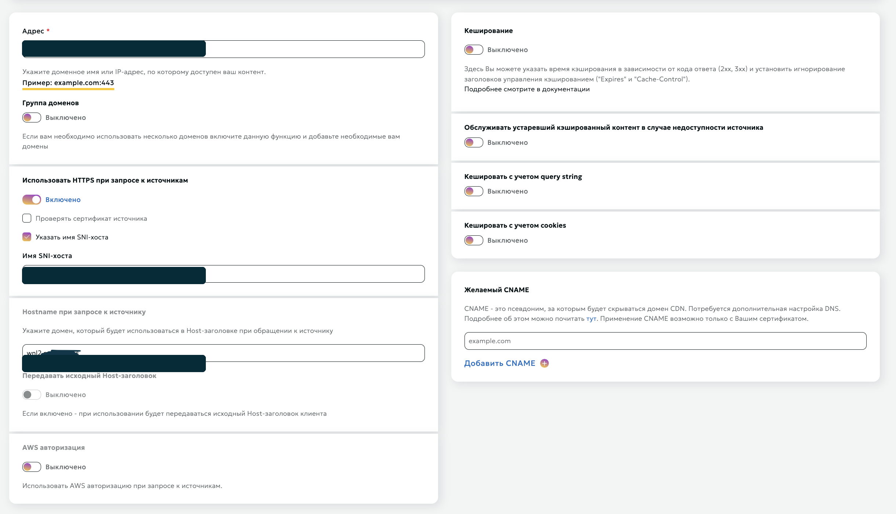
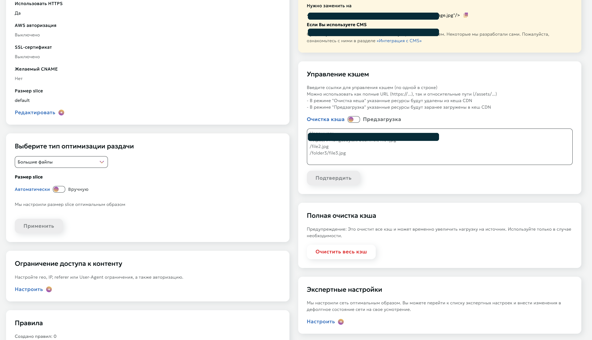
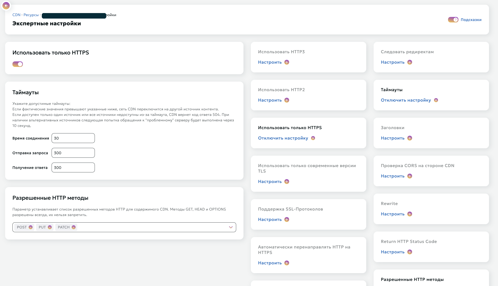

# Beeline CDN + Remnawave xHTTP: GET + XMUX1

Актуальная версия гайда под конфигурацию, проверенную 23 июля 2026 года.

Схема рассчитана на:

```text
Remnawave Node 2.7.0
Xray / rw-core 26.3.27
VLESS + xHTTP
mode: packet-up
uplinkHTTPMethod: GET
Beeline CDN: «Большие файлы»
```

Профиль использует один логический поток внутри XMUX-соединения: `maxConcurrency: "1"`.

`noSSEHeader` должен быть `false`: это обязательный параметр данной конфигурации.

## 1. Обозначения

В гайде реальные адреса заменены:

```text
<ORIGIN_DOMAIN>  домен VPS с nginx и Remnawave Node
<SERVER_IP>      IP этого VPS
<CDN_DOMAIN>     технический домен Beeline вида xxxxx.a.trbcdn.net
```

Рабочий path:

```text
/media/feed/preview.php
```

В Remnawave профиль и host path записывается **без завершающего slash**. Xray при передаче создаёт запрос `/media/feed/preview.php/`; правило Rewrite в Beeline убирает завершающий slash перед отправкой на origin.

## 2. Итоговая схема

```text
клиент
  -> https://<CDN_DOMAIN>:443/media/feed/preview.php/
  -> Beeline CDN
  -> Rewrite: /media/feed/preview.php/ -> /media/feed/preview.php
  -> https://<ORIGIN_DOMAIN>:443/media/feed/preview.php
  -> nginx
  -> внутренний rewrite: /media/feed/preview.php -> /media/feed/preview.php/
  -> http://127.0.0.1:4443
  -> rw-core / VLESS xHTTP
  -> DIRECT
```

**Origin** - настоящий сервер. На нём находятся nginx, сертификат Let's Encrypt и Remnawave Node.

**CDN domain** - адрес Beeline, к которому подключается клиент. Для технического домена `*.a.trbcdn.net` используется сертификат Beeline; собственный CNAME не обязателен.

## 3. DNS и сертификат origin

В DNS создаём только запись origin:

```text
Type: A
Name: <ORIGIN_DOMAIN>
Value: <SERVER_IP>
```

Если DNS управляется через Cloudflare, запись должна быть `DNS only`.

Проверка:

```bash
dig +short <ORIGIN_DOMAIN> A
```

На VPS устанавливаем nginx и выпускаем сертификат:

```bash
apt update
apt install -y nginx certbot python3-certbot-nginx
certbot --nginx -d <ORIGIN_DOMAIN>
```

Файлы сертификата:

```text
/etc/letsencrypt/live/<ORIGIN_DOMAIN>/fullchain.pem
/etc/letsencrypt/live/<ORIGIN_DOMAIN>/privkey.pem
```

Проверка origin:

```bash
curl -vkI https://<ORIGIN_DOMAIN>/
```

## 4. Настройка Beeline CDN

### 4.1. Создание ресурса

Создаём ресурс со следующими параметрами:

```text
Что передавать: Большие файлы
Адрес источника: <ORIGIN_DOMAIN>:443
Использовать HTTPS: да
Размер slice: автоматически / default
Желаемый CNAME: не указывать
SSL-сертификат: не загружать для технического *.a.trbcdn.net
```

Режим «Весь сайт» для этой схемы не требуется.

### 4.2. Источник

```text
Группа доменов: выключено
Использовать HTTPS при запросе к источникам: включено
Проверять сертификат источника: выключено
Указать имя SNI-хоста: включено
Имя SNI-хоста: <ORIGIN_DOMAIN>
Hostname при запросе к источнику: <ORIGIN_DOMAIN>
Передавать исходный Host-заголовок: выключено
AWS авторизация: выключено
```

SNI и Host должны указывать на origin, а не на технический CDN-домен.



### 4.3. Кэширование

Отключаем всё кэширование:

```text
Кэширование: выключено
Игнорировать заголовки управления кэшированием: нет
Обслуживать устаревший кэш при недоступности origin: выключено
Кэшировать с учётом query string: выключено
Кэшировать с учётом cookies: выключено
```

Query string нельзя удалять: в нём xHTTP передаёт `auth` и `chunk_id`. Настройка «кэшировать с учётом query string: выключено» не должна означать удаление query из запроса к origin; она относится только к ключу кэша.

После изменения path или Rewrite выполните полную очистку CDN-кэша. Закэшированный ответ `403 HIT` может сохраняться до очистки.



### 4.4. Протоколы и таймауты

```text
HTTP/2: включить
HTTP/3: выключить
Использовать только HTTPS: включить
Современные версии TLS: включить
Автоматический HTTP -> HTTPS redirect: по желанию

Таймаут соединения: 30
Таймаут отправки: 300
Таймаут получения ответа: 300
```

Клиентский ALPN далее будет `h2,http/1.1`. `h3` в host не добавляем.

`GET`, `HEAD` и `OPTIONS` в Beeline разрешены всегда. Для этого профиля `POST`, `PUT` и `PATCH` не требуются.



### 4.5. Rewrite завершающего slash

В разделе `Expert settings -> Rewrite` добавляем правило:

```text
Где выполнять: на конечных узлах
Откуда: ^/media/feed/preview\.php/$
Куда: /media/feed/preview.php
```

Правило должно сохранять query string. Например:

```text
/media/feed/preview.php/?auth=abc&chunk_id=0
```

должно уйти на origin как:

```text
/media/feed/preview.php?auth=abc&chunk_id=0
```

После применения дождитесь обновления конфигурации CDN и очистите кэш для обоих вариантов:

```text
/media/feed/preview.php
/media/feed/preview.php/
```

На снимке показан раздел Rewrite. Для установки достаточно одного точного правила, указанного выше.


## 5. nginx на origin

Сначала сделайте резервную копию текущего virtual host:

```bash
cp /etc/nginx/sites-available/<ORIGIN_DOMAIN> \
   /etc/nginx/sites-available/<ORIGIN_DOMAIN>.backup
```

Откройте конфигурацию:

```bash
nano /etc/nginx/sites-available/<ORIGIN_DOMAIN>
```

Используйте конфигурацию с одним inbound:

```nginx
server {
    listen 80;
    listen [::]:80;
    server_name <ORIGIN_DOMAIN>;

    location /.well-known/acme-challenge/ {
        root /var/www/certbot;
    }

    location / {
        return 301 https://$host$request_uri;
    }
}

server {
    listen 443 ssl http2;
    listen [::]:443 ssl http2;
    server_name <ORIGIN_DOMAIN>;

    ssl_certificate     /etc/letsencrypt/live/<ORIGIN_DOMAIN>/fullchain.pem;
    ssl_certificate_key /etc/letsencrypt/live/<ORIGIN_DOMAIN>/privkey.pem;
    ssl_protocols TLSv1.2 TLSv1.3;

    location ^~ /media/feed/preview.php {
        # Beeline отправляет файловый path без slash. Xray 26.3.27
        # на inbound ожидает transport path с завершающим slash.
        rewrite ^/media/feed/preview\.php$ /media/feed/preview.php/ break;

        client_max_body_size 0;

        if ($request_method = HEAD) {
            return 204;
        }

        proxy_pass http://127.0.0.1:4443;
        proxy_http_version 1.1;

        proxy_set_header Host $host;
        proxy_set_header X-Real-IP $remote_addr;
        proxy_set_header X-Forwarded-For $proxy_add_x_forwarded_for;
        proxy_set_header X-Forwarded-Proto https;
        proxy_set_header Connection "";

        proxy_buffering off;
        proxy_request_buffering off;
        proxy_cache off;
        proxy_socket_keepalive on;

        proxy_connect_timeout 10s;
        proxy_read_timeout 3600s;
        proxy_send_timeout 3600s;
        client_body_timeout 3600s;
        send_timeout 3600s;

        add_header Cache-Control "no-store, no-cache, max-age=0" always;
        add_header Pragma "no-cache" always;
    }
}
```

Если файл ещё не подключён:

```bash
ln -s /etc/nginx/sites-available/<ORIGIN_DOMAIN> \
      /etc/nginx/sites-enabled/<ORIGIN_DOMAIN>
```

Проверка и применение:

```bash
nginx -t
systemctl reload nginx
systemctl status nginx --no-pager
```

Не публикуйте порт `4443` наружу. Он должен слушать только `127.0.0.1`; клиент всегда входит через nginx на `443`.

## 6. Remnawave config profile

Создайте config profile со следующим inbound.

JSON профиля:

```json
{
  "log": {
    "loglevel": "warning"
  },
  "dns": {
    "servers": [
      {
        "address": "8.8.8.8",
        "skipFallback": false
      }
    ],
    "queryStrategy": "UseIPv4"
  },
  "inbounds": [
    {
      "tag": "CDN_SCREENSHOT_EXPERIMENT",
      "port": 4443,
      "listen": "127.0.0.1",
      "protocol": "vless",
      "settings": {
        "clients": [],
        "decryption": "none"
      },
      "streamSettings": {
        "network": "xhttp",
        "xhttpSettings": {
          "mode": "packet-up",
          "path": "/media/feed/preview.php",
          "xmux": {
            "maxConcurrency": "1"
          },
          "seqKey": "chunk_id",
          "sessionKey": "auth",
          "noSSEHeader": false,
          "noGRPCHeader": true,
          "seqPlacement": "query",
          "sessionIDKey": "auth",
          "xPaddingBytes": "50-150",
          "xPaddingMethod": "tokenish",
          "sessionIDLength": "16-32",
          "sessionPlacement": "query",
          "uplinkHTTPMethod": "GET",
          "xPaddingObfsMode": true,
          "xPaddingPlacement": "header",
          "scMaxBufferedPosts": 100,
          "scMaxEachPostBytes": 3000000,
          "sessionIDPlacement": "query",
          "uplinkDataPlacement": "body",
          "scMinPostsIntervalMs": "5-10",
          "serverMaxHeaderBytes": 32768
        }
      }
    }
  ],
  "outbounds": [
    {
      "tag": "DIRECT",
      "protocol": "freedom"
    },
    {
      "tag": "BLOCK",
      "protocol": "blackhole"
    }
  ],
  "routing": {
    "rules": [
      {
        "ip": [
          "geoip:private"
        ],
        "type": "field",
        "outboundTag": "BLOCK"
      },
      {
        "type": "field",
        "protocol": [
          "bittorrent"
        ],
        "outboundTag": "BLOCK"
      }
    ]
  }
}
```

Не добавляйте отсутствующие в JSON `xPaddingKey` и `xPaddingHeader`: в проверенной конфигурации используются значения Xray по умолчанию.

После сохранения:

1. Назначьте config profile нужной ноде.
2. В `Active inbounds` включите `CDN_SCREENSHOT_EXPERIMENT`.
3. Добавьте этот inbound во внутренний squad, который используется подписчиками.
4. Убедитесь, что пользователи входят в этот squad.
5. Проверьте, что нода перешла в `Connected`.

В профиле должен оставаться ровно один inbound на `127.0.0.1:4443`. Два inbound на одном адресе и порту создают конфликт и приводят к `N/A` в клиенте.

## 7. Remnawave host

Создайте host:

```text
Remark: понятное название, например Germany CDN Beeline GET XMUX1
Address: <CDN_DOMAIN>
Port: 443
Security layer: TLS
SNI: <CDN_DOMAIN>
Host: <CDN_DOMAIN>
Path: /media/feed/preview.php
ALPN: h2,http/1.1
Fingerprint: chrome
Allow insecure: false
Keep SNI blank: выключено
```

Привяжите host к созданному inbound и к нужной ноде.

В поле `xHTTP extra params` вставьте:

```json
{
  "mode": "packet-up",
  "path": "/media/feed/preview.php",
  "xmux": {
    "maxConcurrency": "1"
  },
  "seqKey": "chunk_id",
  "sessionKey": "auth",
  "noSSEHeader": false,
  "noGRPCHeader": true,
  "seqPlacement": "query",
  "sessionIDKey": "auth",
  "xPaddingBytes": "50-150",
  "xPaddingMethod": "tokenish",
  "sessionIDLength": "16-32",
  "sessionPlacement": "query",
  "uplinkHTTPMethod": "GET",
  "xPaddingObfsMode": true,
  "xPaddingPlacement": "header",
  "scMaxBufferedPosts": 100,
  "scMaxEachPostBytes": 3000000,
  "sessionIDPlacement": "query",
  "uplinkDataPlacement": "body",
  "scMinPostsIntervalMs": "5-10",
  "serverMaxHeaderBytes": 32768
}
```

Inbound и host должны совпадать по следующим полям:

```text
mode
path
seqKey / seqPlacement
sessionKey / sessionIDKey / session placement
uplinkHTTPMethod / uplinkDataPlacement
xPadding settings
noSSEHeader
```

Host можно отдавать в `XRAY_JSON`: проверенная подписка корректно сформировала этот профиль.

## 8. Шаблон подписки CDN02

В Remnawave откройте `Subscription templates` и выберите шаблон `CDN02`.

Скопируйте UUID созданного host и укажите его единственным значением в `remnawave.injectHosts`:

```json
{
  "remnawave": {
    "injectHosts": [
      {
        "selector": {
          "type": "uuids",
          "values": [
            "<HOST_UUID>"
          ]
        },
        "tagPrefix": "proxy",
        "selectFrom": "ALL"
      }
    ]
  }
}
```

В `values` должен находиться UUID того же host, который связан с `CDN_SCREENSHOT_EXPERIMENT`. После сохранения обновите подписку и проверьте, что в сгенерированном outbound присутствуют:

```text
address: <CDN_DOMAIN>
port: 443
network: xhttp
path: /media/feed/preview.php
xmux.maxConcurrency: 1
sessionKey: auth
seqKey: chunk_id
```

## 9. Проверка

### 9.1. DNS, TLS и origin

```bash
dig +short <ORIGIN_DOMAIN> A
curl -vkI https://<ORIGIN_DOMAIN>/media/feed/preview.php
curl -vkI https://<CDN_DOMAIN>/media/feed/preview.php
curl -vkI https://<CDN_DOMAIN>/media/feed/preview.php/
```

Для `HEAD` конфигурация nginx выше возвращает `204`. Если проверять обычным `GET` без VLESS-данных, возможен `400`; это не обязательно ошибка.

`403` с `x-cdn-edge-cache: HIT` означает, что edge отдал закэшированный ответ или Rewrite ещё не применился. Очистите кэш и повторите проверку после применения настроек.

### 9.2. nginx

Во время подключения клиента:

```bash
tail -f /var/log/nginx/access.log
```

Рабочие запросы выглядят примерно так:

```text
GET /media/feed/preview.php?auth=<session>&chunk_id=0 HTTP/1.1 200
GET /media/feed/preview.php?auth=<session> HTTP/1.1 200
```

Если запросов нет, проблема находится до origin: DNS, CDN resource, TLS, Rewrite или host клиента.

### 9.3. Remnawave Node

```bash
docker ps
docker logs --since 10m remnanode
ss -lntp | grep ':4443'
```

Ожидаем:

```text
Node: Connected
Xray 26.3.27 started
127.0.0.1:4443 LISTEN
```

В логах Xray при реальном запросе должен появиться `accepted ... >> DIRECT`.

### 9.4. Клиент

После изменения extra params заново обновите подписку и перезапустите подключение, чтобы клиент перечитал transport config.

Проверяйте не только Speedtest:

```text
несколько HTTPS-сайтов подряд
Telegram и загрузку медиа
Reels / короткие видео
8-10 одновременных запросов
длительную загрузку файла
```

## 10. Типовые проблемы

### Host показывает N/A

Проверьте:

```text
CDN resource активен
технический CDN-домен резолвится
TLS-сертификат *.a.trbcdn.net валиден
host привязан к inbound и ноде
inbound активен на ноде
пользователь входит в squad
в CDN02 указан UUID этого host
на 127.0.0.1:4443 запущен только один inbound
```

### Подключение есть, но трафик 0 B

Чаще всего не совпадают `path`, `auth/chunk_id`, extra params или запрос попадает не в тот inbound.

### Соединение периодически зависает

Проверьте, что:

```text
noSSEHeader: false
xmux.maxConcurrency: "1"
uplinkHTTPMethod: GET
HTTP/2 включён
HTTP/3 выключен
кэширование выключено
Rewrite сохраняет query string
```

Значение `noSSEHeader: true` для этой схемы не используется.

### Скорость высокая, но сайты открываются долго

Это может быть задержка создания xHTTP-сессий или ограничение CDN на множество мелких запросов. `maxConcurrency: "1"` уменьшает нагрузку внутри одного XMUX-соединения, но не гарантирует максимальную скорость на любом клиенте. Сравнивайте стабильность реальных приложений, а не только пиковое значение Speedtest.

## 11. Быстрый чек-лист

```text
DNS:
  <ORIGIN_DOMAIN> A <SERVER_IP>

Beeline:
  тип: Большие файлы
  source: <ORIGIN_DOMAIN>:443
  HTTPS to origin: on
  SNI: <ORIGIN_DOMAIN>
  Hostname: <ORIGIN_DOMAIN>
  pass client Host: off
  cache: off
  query/cookies cache: off
  HTTP/2: on
  HTTP/3: off
  timeouts: 30 / 300 / 300
  rewrite: ^/media/feed/preview\.php/$ -> /media/feed/preview.php

nginx:
  location ^~ /media/feed/preview.php
  internal rewrite to /media/feed/preview.php/
  proxy_pass http://127.0.0.1:4443
  buffering/request_buffering/cache: off

Remnawave profile and host:
  один inbound: CDN_SCREENSHOT_EXPERIMENT
  listen: 127.0.0.1:4443
  VLESS + xhttp
  mode: packet-up
  path: /media/feed/preview.php
  GET
  noSSEHeader: false
  xmux.maxConcurrency: "1"
  session: auth
  sequence: chunk_id
  ALPN: h2,http/1.1
  fingerprint: chrome

CDN02:
  injectHosts.values: только <HOST_UUID>
```
