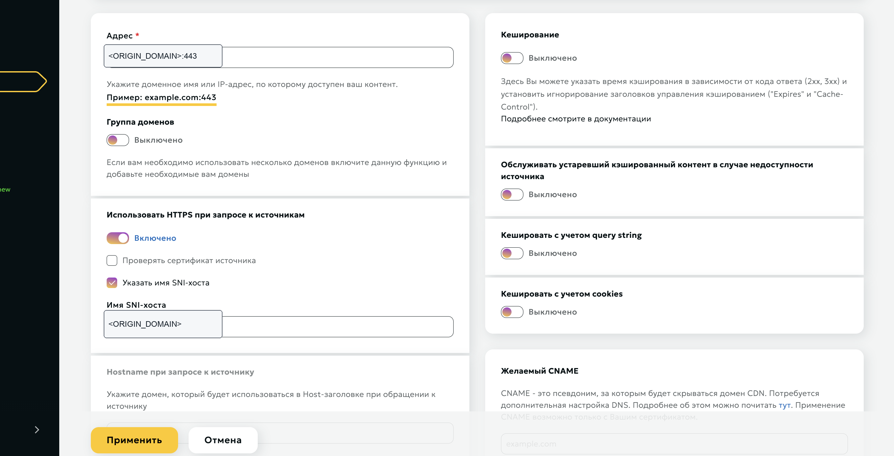
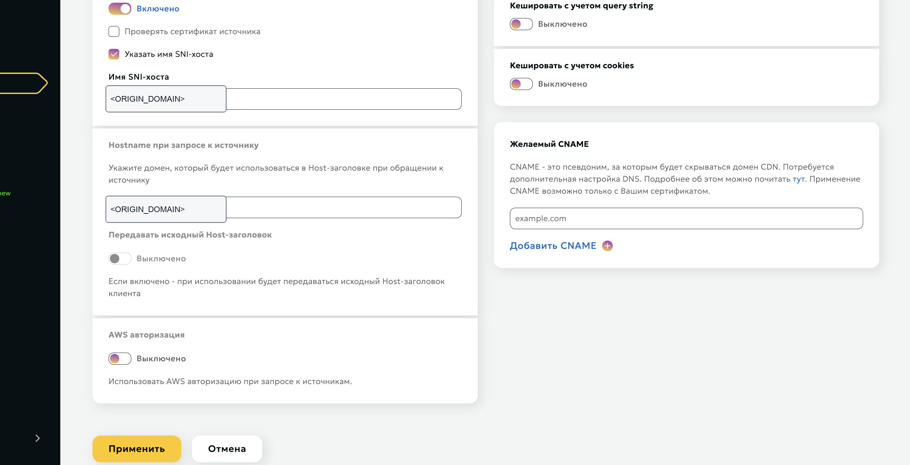
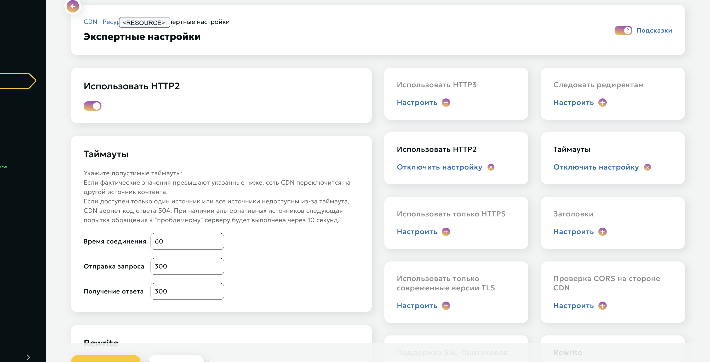
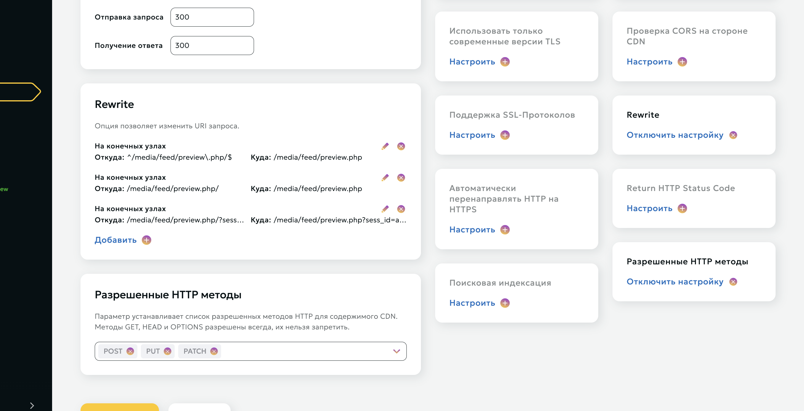

# Beeline CDN + Remnawave Node + xHTTP

Гайд описывает рабочую схему:

```text
клиент
  -> <CDN_DOMAIN>:443
  -> Beeline CDN
  -> https://<ORIGIN_DOMAIN>:443
  -> nginx на VPS
  -> rw-core / Remnawave Node на 127.0.0.1:4443
```

Значения замени на свои:

```text
<ORIGIN_DOMAIN>  = домен origin-сервера, A-запись смотрит на VPS
<CDN_DOMAIN>     = домен, который выдал Beeline CDN
<NODE_IP>        = IP VPS с nginx и Remnawave Node
<PANEL_URL>      = домен Remnawave-панели
```

В нашем рабочем варианте использовался Remnawave Node `2.7.0` с Xray `26.3.27`. Это важно: обычный vanilla `xray 26.3.27` не подходит для Remnawave Node, нужен именно образ `remnawave/node:2.7.0`.

## 1. Что такое origin и CDN

`Origin` — это твой реальный сервер, куда CDN ходит за контентом. В этой схеме origin — `<ORIGIN_DOMAIN>:443`, который указывает на `<NODE_IP>`.

`CDN domain` — это внешний домен Beeline CDN. Клиент подключается именно к нему: `<CDN_DOMAIN>:443`.

В Remnawave Host указывается не origin, а CDN-домен.

## 2. DNS

Для origin-домена:

```text
<ORIGIN_DOMAIN>  A  <NODE_IP>
```

Если используешь CNAME на свой CDN-домен, то в DNS у своего домена указываешь CNAME на домен Beeline CDN. В нашем варианте CNAME не использовался, клиент ходил напрямую на домен, который выдал Beeline.

## 3. Сертификат на origin

На VPS нужен HTTPS-сертификат для `<ORIGIN_DOMAIN>`.

Пример через certbot:

```bash
apt update
apt install -y nginx certbot python3-certbot-nginx
certbot --nginx -d <ORIGIN_DOMAIN>
```

После выпуска сертификата проверка:

```bash
curl -I https://<ORIGIN_DOMAIN>/media/feed/preview.php
```

Для обычного curl это может быть `204` или `400`; это нормально. Главное, чтобы был HTTPS и nginx отвечал.

## 4. Beeline CDN: основной ресурс

Тип оптимизации:

```text
Большие файлы
```

Источник:

```text
Адрес: <ORIGIN_DOMAIN>:443
Группа доменов: выключено
Использовать HTTPS при запросе к источникам: включено
Проверять сертификат источника: выключено
Указать имя SNI-хоста: включено
Имя SNI-хоста: <ORIGIN_DOMAIN>
Hostname при запросе к источнику: <ORIGIN_DOMAIN>
Передавать исходный Host-заголовок: выключено
AWS авторизация: выключено
```

Кэширование:

```text
Кэширование: выключено
Обслуживать устаревший кэшированный контент: выключено
Кэшировать с учетом query string: выключено
Кэшировать с учетом cookies: выключено
```

Желаемый CNAME:

```text
Не указывать, если работаешь через выданный Beeline CDN-домен.
```

Скрин:





## 5. Beeline CDN: экспертные настройки

В экспертных настройках:

```text
Использовать HTTP2: включено
Использовать HTTP3: не настраивали
Следовать редиректам: не настраивали
Использовать только HTTPS: не обязательно
Использовать только современные версии TLS: не настраивали
```

Таймауты:

```text
Время соединения: 60
Отправка запроса: 300
Получение ответа: 300
```

Разрешенные HTTP-методы:

```text
GET, HEAD, OPTIONS разрешены всегда
POST: добавлен
PUT: добавлен
PATCH: добавлен
```

Скрин:



## 6. Beeline CDN: Rewrite

Rewrite нужен из-за старого xHTTP-поведения: старые Xray-клиенты добавляют `/` в конец path. Beeline на таком пути отдавал `403 x-reason-code: 7`, поэтому slash убирается на стороне CDN до запроса к origin.

Правила ставятся:

```text
Где выполнять rewrite: На конечных узлах
```

Правила:

```text
Откуда: ^/media/feed/preview\.php/$
Куда:   /media/feed/preview.php

Откуда: /media/feed/preview.php/
Куда:   /media/feed/preview.php
```

Если в твоем интерфейсе Beeline rewrite обрабатывает query string отдельным правилом, добавь правило с той же логикой: убрать `/` перед `?` и сохранить query-параметры.

```text
Откуда: ^/media/feed/preview\.php/\?(.*)$
Куда:   /media/feed/preview.php?$1
```

Смысл всех rewrite-правил один:

```text
/media/feed/preview.php/                 -> /media/feed/preview.php
/media/feed/preview.php/?sess_id=...     -> /media/feed/preview.php?sess_id=...
```

Скрин:



## 7. Remnawave Node на VPS

Compose должен быть закреплен на `remnawave/node:2.7.0`, если нужна совместимость с `Xray 26.3.27`.

`/opt/remnanode/docker-compose.yml`:

```yaml
services:
  remnanode:
    container_name: remnanode
    hostname: remnanode
    image: remnawave/node:2.7.0
    network_mode: host
    restart: always
    cap_add:
      - NET_ADMIN
    ulimits:
      nofile:
        soft: 1048576
        hard: 1048576
    environment:
      - NODE_PORT=2222
      - SECRET_KEY=<SECRET_KEY_FROM_PANEL>
```

Проверка:

```bash
docker ps --format 'table {{.Names}}\t{{.Image}}\t{{.Status}}'
docker exec remnanode /usr/local/bin/xray version
docker logs --tail 100 remnanode
```

Ожидаемо:

```text
IMAGE: remnawave/node:2.7.0
Xray: 26.3.27
Xray started
```

## 8. Nginx на origin

Рабочий путь с Beeline:

```text
/media/feed/preview.php
```

Beeline CDN должен отправлять на origin путь без trailing slash. Но `rw-core` в старом `26.3.27` ожидает path со slash, поэтому nginx добавляет `/` только при проксировании внутрь.

Актуальный nginx:

```nginx
server {
    listen 80;
    listen [::]:80;
    server_name <ORIGIN_DOMAIN>;

    location /.well-known/acme-challenge/ {
        root /var/www/certbot;
    }

    location / {
        return 301 https://$host$request_uri;
    }
}

server {
    listen 443 ssl http2;
    listen [::]:443 ssl http2;
    server_name <ORIGIN_DOMAIN>;

    ssl_certificate     /etc/letsencrypt/live/<ORIGIN_DOMAIN>/fullchain.pem;
    ssl_certificate_key /etc/letsencrypt/live/<ORIGIN_DOMAIN>/privkey.pem;
    ssl_protocols TLSv1.2 TLSv1.3;

    location ^~ /media/feed/preview.php {
        rewrite ^/media/feed/preview\.php$ /media/feed/preview.php/ break;
        client_max_body_size 0;

        if ($request_method = HEAD) {
            return 204;
        }

        if ($args = "") {
            return 204;
        }

        proxy_pass http://127.0.0.1:4443;
        proxy_http_version 1.1;

        proxy_set_header Host $host;
        proxy_set_header X-Real-IP $remote_addr;
        proxy_set_header X-Forwarded-For $proxy_add_x_forwarded_for;
        proxy_set_header X-Forwarded-Proto https;

        proxy_set_header Upgrade $http_upgrade;
        proxy_set_header Connection $http_connection;
        proxy_set_header Sec-WebSocket-Protocol $http_sec_websocket_protocol;

        proxy_buffering off;
        proxy_request_buffering off;
        proxy_cache off;

        proxy_read_timeout 3600s;
        proxy_send_timeout 3600s;
        send_timeout 3600s;

        add_header Cache-Control "no-store, no-cache, max-age=0" always;
        add_header Pragma "no-cache" always;
    }
}
```

Проверка:

```bash
nginx -t
systemctl reload nginx
```

## 9. Remnawave Config Profile

Профиль:

```text
name: germany-xhttp-cdn-02
inbound tag: CDN_TEST_02
listen: 127.0.0.1
port: 4443
protocol: vless
network: xhttp
```

JSON профиля:

```json
{
  "log": {
    "loglevel": "warning"
  },
  "dns": {
    "servers": [
      {
        "address": "8.8.8.8",
        "skipFallback": false
      }
    ],
    "queryStrategy": "UseIPv4"
  },
  "inbounds": [
    {
      "tag": "CDN_TEST_02",
      "listen": "127.0.0.1",
      "port": 4443,
      "protocol": "vless",
      "settings": {
        "clients": [],
        "decryption": "none"
      },
      "streamSettings": {
        "network": "xhttp",
        "xhttpSettings": {
          "mode": "packet-up",
          "path": "/media/feed/preview.php",
          "xmux": {
            "cMaxLifetimeMs": 0,
            "cMaxReuseTimes": "64-128",
            "maxConcurrency": "24-48",
            "maxConnections": 0,
            "hMaxRequestTimes": "600-1000",
            "hMaxReusableSecs": "1800-3600"
          },
          "seqKey": "segment",
          "sessionKey": "sess_id",
          "xPaddingKey": "_t",
          "seqPlacement": "query",
          "sessionIDKey": "sess_id",
          "uplinkDataKey": "X-Playback-Token",
          "xPaddingBytes": "1-32",
          "xPaddingHeader": "X-Media-Token",
          "xPaddingMethod": "tokenish",
          "sessionIDLength": "5-8",
          "uplinkChunkSize": 0,
          "sessionPlacement": "query",
          "uplinkHTTPMethod": "GET",
          "xPaddingObfsMode": true,
          "xPaddingPlacement": "header",
          "scMaxEachPostBytes": 1000000,
          "sessionIDPlacement": "query",
          "uplinkDataPlacement": "body",
          "serverMaxHeaderBytes": 50000
        }
      }
    }
  ],
  "outbounds": [
    {
      "tag": "DIRECT",
      "protocol": "freedom"
    },
    {
      "tag": "BLOCK",
      "protocol": "blackhole"
    }
  ],
  "routing": {
    "rules": [
      {
        "ip": [
          "geoip:private"
        ],
        "type": "field",
        "outboundTag": "BLOCK"
      },
      {
        "type": "field",
        "protocol": [
          "bittorrent"
        ],
        "outboundTag": "BLOCK"
      }
    ]
  }
}
```

## 10. Remnawave Host

Host в панели:

```text
Remark: Германия #5 БС (CDN Beeline)
Address: <CDN_DOMAIN>
Port: 443
TLS: включено
Security layer: TLS
SNI: <CDN_DOMAIN>
Host: <CDN_DOMAIN>
Path: /media/feed/preview.php
ALPN: h2,http/1.1
Fingerprint: chrome
Inbound: CDN_TEST_02
Node: Germany05 (CDN)
```

Extra/xHTTP params в host:

```json
{
  "mode": "packet-up",
  "path": "/media/feed/preview.php",
  "xmux": {
    "cMaxLifetimeMs": 0,
    "cMaxReuseTimes": "64-128",
    "maxConcurrency": "24-48",
    "maxConnections": 0,
    "hMaxRequestTimes": "600-1000",
    "hMaxReusableSecs": "1800-3600"
  },
  "seqKey": "segment",
  "sessionKey": "sess_id",
  "xPaddingKey": "_t",
  "seqPlacement": "query",
  "sessionIDKey": "sess_id",
  "uplinkDataKey": "X-Playback-Token",
  "xPaddingBytes": "1-32",
  "xPaddingHeader": "X-Media-Token",
  "xPaddingMethod": "tokenish",
  "sessionIDLength": "5-8",
  "uplinkChunkSize": 0,
  "sessionPlacement": "query",
  "uplinkHTTPMethod": "GET",
  "xPaddingObfsMode": true,
  "xPaddingPlacement": "header",
  "scMaxEachPostBytes": 1000000,
  "sessionIDPlacement": "query",
  "uplinkDataPlacement": "body",
  "serverMaxHeaderBytes": 50000
}
```

## 11. Почему path без slash в панели, но со slash в nginx

В панели и host указываем:

```text
/media/feed/preview.php
```

У старого Xray `26.3.27` клиентская сторона может сформировать запрос:

```text
/media/feed/preview.php/
```

Beeline CDN такой путь режет и может вернуть:

```text
HTTP/2 403
x-reason-code: 7
```

Поэтому на Beeline делаем rewrite:

```text
/media/feed/preview.php/ -> /media/feed/preview.php
```

Но серверный `rw-core` на `26.3.27` ожидает path со slash. Поэтому nginx перед проксированием внутрь делает обратную внутреннюю правку:

```nginx
rewrite ^/media/feed/preview\.php$ /media/feed/preview.php/ break;
```

Итог:

```text
Клиент/подписка:       /media/feed/preview.php
Beeline к origin:      /media/feed/preview.php
nginx к rw-core:       /media/feed/preview.php/
```

## 12. Проверки

DNS:

```bash
nslookup <ORIGIN_DOMAIN>
nslookup <CDN_DOMAIN>
```

Origin:

```bash
curl -vk https://<ORIGIN_DOMAIN>/media/feed/preview.php
```

CDN:

```bash
curl -vk https://<CDN_DOMAIN>/media/feed/preview.php
curl -vk "https://<CDN_DOMAIN>/media/feed/preview.php/?sess_id=test&segment=0"
```

Нормально:

```text
нет x-reason-code: 7
нет 403 от CDN
запрос появляется в /var/log/nginx/access.log
```

Для полноценной проверки нужен VLESS/xHTTP-клиент, обычный `curl` не проверяет VLESS-протокол.

Проверка ноды:

```bash
docker logs --tail 100 remnanode
docker exec remnanode /usr/local/bin/xray version
```

Ожидаемо:

```text
Remnawave Node v2.7.0
XRay Core: v26.3.27
Xray started
```

## 13. Частые ошибки

`403 x-reason-code: 7` от Beeline:

```text
CDN режет URI до origin.
Проверить rewrite: /media/feed/preview.php/ должен превращаться в /media/feed/preview.php.
```

`404` в nginx access log от rw-core:

```text
Запрос дошел до origin, но path не совпал с тем, что ожидает xHTTP inbound.
Для Xray 26.3.27 nginx должен проксировать внутрь /media/feed/preview.php/.
```

Host в Remnawave показывает `N/A`:

```text
Проверить, что host привязан к нужному inbound и node.
Проверить, что node connected.
Проверить, что CDN-домен доступен по HTTPS.
```

Клиент подключается, но трафик 0B:

```text
Проверить Host/SNI: должны быть <CDN_DOMAIN>.
Проверить Path: /media/feed/preview.php.
Проверить ALPN: h2,http/1.1.
Проверить, что Beeline rewrite уже применился.
Проверить nginx access.log: должны быть GET-запросы на /media/feed/preview.php?... от edge IP Beeline.
```

